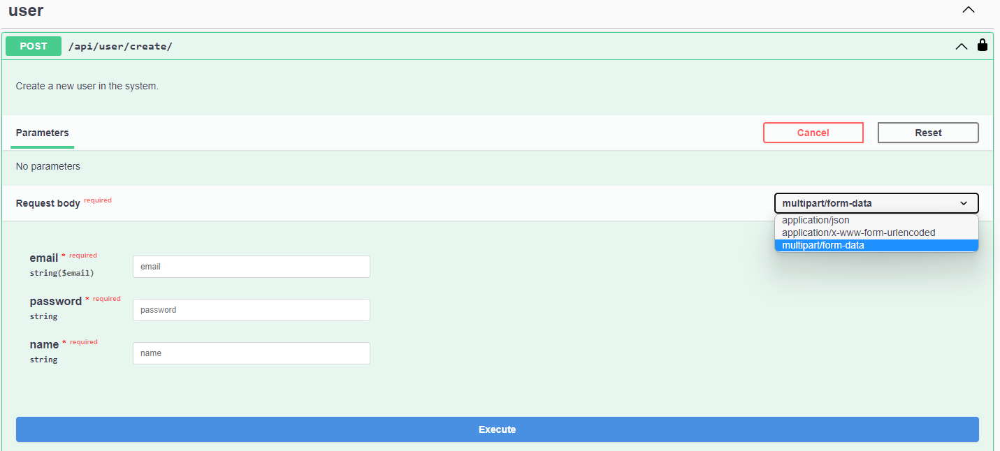
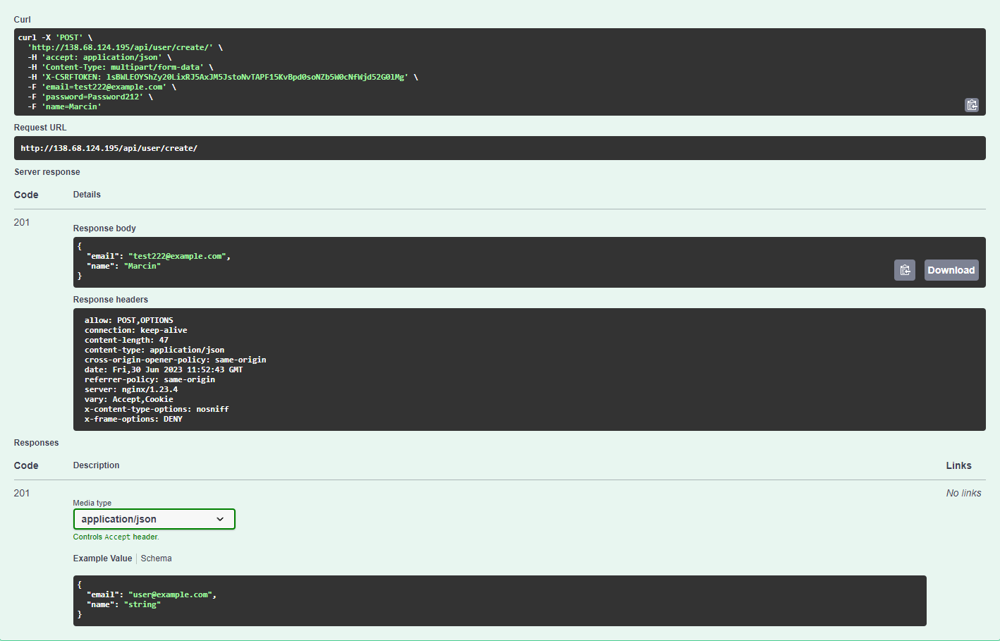
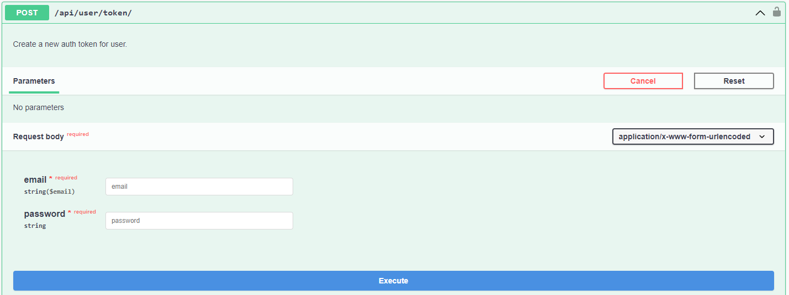
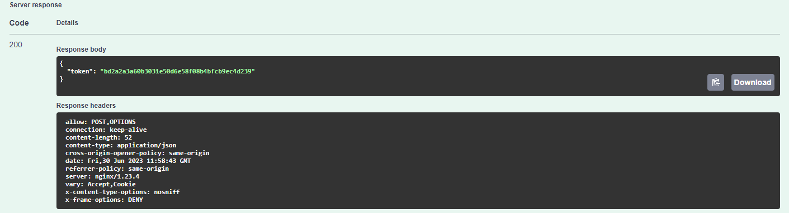
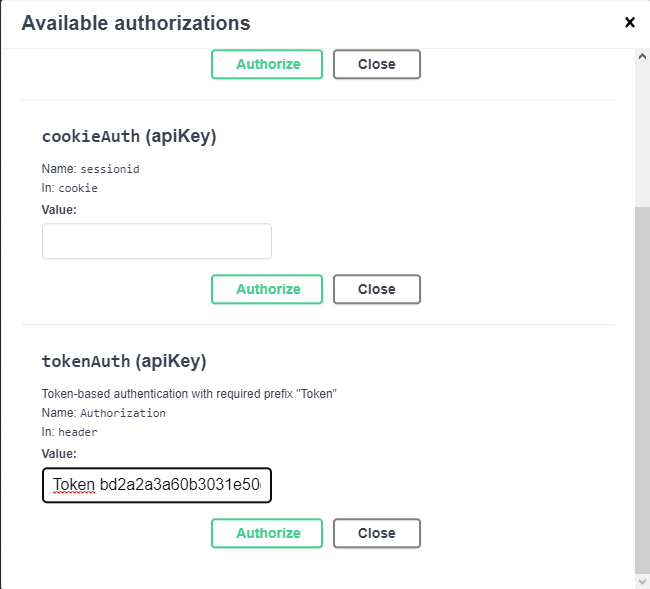

# Recipe API

### About project
It's an API create with usage of the Django 4.2, Django REST 3.14 and Docker. 
Interface have a typical as for CRUD project functionalities to: create, read, update and delete the objects.
By a usage of an API, as authenticated user, we can create a new recipe or ingredient.
Authenticated user can partially or fully update details of the created object or 
send a request to the API for a created object details. We can also attach an image to the recipe.
Whole project has been built in the TDD method. For testing and linting I was using a Django built-in test
module (mostly TestCase) and flake8 package. I used a GitHub actions to start a tests and check the linting for
each pull request which i did. It makes work faster and more comfortable.

### Deploying
API is deployed on a DigitalOcean with usage of Linux Ubuntu 22.04 instance and Docker 20.10.21 version. 
Project have a documentation created by a DRF-spectacular with a Swagger UI. You can check it under the link below. 
#### Documentation -> http://138.68.124.195/api/docs/
Documentation have an interface and you can check how the API is working by yourself.

### How to check an API by a Swagger UI?
First you need to create a user. Scroll down and find a <strong>user</strong> part.
Click on the "POST" method and "try it out" button.

From the dropdown menu on the right side choose multipart/form-data. It's the easiest and the most
comfortable method to make a requests to the API. Fill the blank fields and click "execute".
If your inputs are corrected you should receive the following response with status code 201.

If you have a user. Now you need to generate a authentication token and authenticate yourself. 
Open the last "POST" method request from the list with a link "api/user/token/" and the same steps
as creating a user.

You should receive the following response.

Copy the token green string without double-quotes and scroll to the top of the page. 
Click the "Authorization" button and find TokenAuth in the modal's list. 
Type Token and paste your token. Click authorize.

#### Now you can test all the functionalities of the API as an authenticated user. Enjoy!
